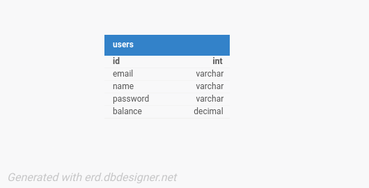
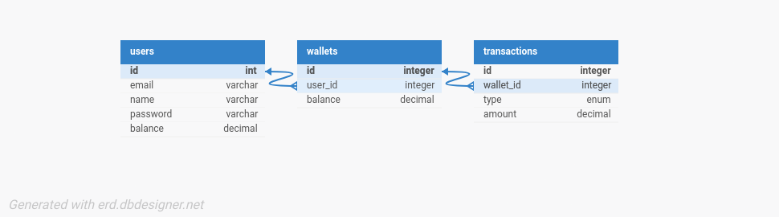

# DemoCredit

A backend API service built with Node.js and Express that allows users to fund accounts, transfer funds between users, and withdraw funds. Built as an assessment for a backend engineering role at Lendsqr.

## Features

- Create Account: Create a user account - if the user is not blacklisted
- Fund Account: Add money to user accounts.
- Transfer Funds: Transfer money between users securely.
- Withdraw Funds: Allow users to withdraw money from their accounts.

## Technologies Used

- Node.js
- Knex.js
- MySQL Database
- Vitest
- TypeScript

## Optional Setup, but recommended

1. Set up a MySQL database container in Docker:

```bash
docker run --name lendDb -e MYSQL_ROOT_PASSWORD=testPassword123 -p 3306:3306 -d mysql:8.2.0
```

2. Exec into the container:

 ```bash
 docker exec -it lendDb bash
 ```

3. Connect to the database. Type in the password when prompted.

 ```bash
 mysql -u root -p
 ```

4. Once connected, create a new database:

 ```bash
 CREATE DATABASE lendDb;
 ```

5. Use the following values in the env file below to connect to this database:

 ```properties
 PORT=3000
 DB_HOST=localhost
 DB_PORT=3306
 DB_USER=root
 DB_PASSWORD=testPassword123
 DB_NAME=lendDb
 ```

## Setup

1. Clone the repository

 ```bash
 git clone github.com/henrychris/lendsqr-assessment
 cd lendsqr-assessment
 ```

2. Install dependencies

 ```bash
 npm install
 ```

3. Setup environment variables

Create a `.env` file in the repository root and provide the following:

 ```properties
 PORT
 DB_HOST
 DB_PORT
 DB_USER
 DB_PASSWORD
 DB_NAME
 APP_KEY
 ```

`APP_KEY` is the secret key of the application created on Adjutor.

4. Run database migrations

 ```bash
 npm run migrate
 ```

5. Start the development server

 ```bash
 npm run dev
 ```

## Usage

Once the server is running, you can use Postman or cURL to interact with the API.

## API Endpoints

Assume `BASE_URL` is `http://localhost:3000`.

### 1. Create a User  

**Endpoint:**  
`POST BASE_URL/users/create`  

**Description:**  
Creates a new user account. Returns a user ID and an authentication token for future requests.  

**Request Body:**

```json
{
  "name": "Rabome",
  "email": "rabome@email.com",
  "password": "testPassword123"
}
```

**Response:**

```json
{
  "message": "Account created",
  "userId": 4,
  "token": "token-4-1729184326749"
}
```

---

### 2. User Login

**Endpoint:**  
`POST BASE_URL/users/login`  

**Description:**  
Logs in a user and returns the user's ID, balance, and an authentication token.  

**Request Body:**

```json
{
  "email": "martie@email.com",
  "password": "testPassword123"
}
```

**Response:**

```json
{
  "userId": 3,
  "name": "Martie",
  "email": "martie@email.com",
  "balance": 11000,
  "token": "token-3-1729246734118"
}
```

---

### 3. Withdraw Funds

**Endpoint:**  
`POST BASE_URL/account/withdraw`  

**Description:**  
Withdraws a specified amount from the authenticated user’s account.  

**Headers:**  
`Authorization: Bearer <token>`  

**Request Body:**

```json
{
  "amount": 1000
}
```

**Response:**

```json
{
  "message": "Withdrawal successful"
}
```

---

### 4. Transfer Funds

**Endpoint:**  
`POST BASE_URL/account/transfer`  

**Description:**  
Transfers a specified amount from the authenticated user to the recipient specified by email.  

**Headers:**  
`Authorization: Bearer <token>`  

**Request Body:**

```json
{
  "recipientEmail": "martie@email.com",
  "amount": 1000
}
```

**Response:**

```json
{
  "message": "Transfer successful"
}
```

---

### 5. Fund Account

**Endpoint:**  
`POST BASE_URL/account/fund`  

**Description:**  
Adds a specified amount to the authenticated user’s account balance.  

**Headers:**  
`Authorization: Bearer <token>`  

**Request Body:**

```json
{
  "amount": 4000
}
```

**Response:**

```json
{
  "message": "Account funded"
}
```

---

### Error Handling and Validation

- **Validation Errors:**  
  If there are issues with input data (e.g., missing fields or invalid values), the API returns a `422` status code with the following response structure:

  ```json
  {
    "errors": ["Invalid email address", "Password must be at least 8 characters"]
  }
  ```

  Each string represent a separate validation error.

- **General Failure Responses:**  
  In case of other errors (e.g., authentication failures or internal errors), the following structure is used:

  ```json
  {
    "error": "Invalid token"
  }
  ```

## Testing

To run unit tests, use the following command:

```bash
npm run test
```

## Database Design

For simplicity, this MVP uses a single table.



This table stores both user data & their account balance. In a real-world application we might instead create `User`, `Wallet` and `Transaction` tables. It could look similar to this:



## Known Issues

### Blacklist Check

Before creating a user, we check the Karma blacklist to see if they are clear:

```ts
const isBlacklisted = await checkBlacklist(email);
        if (isBlacklisted) {
            res.status(403).json({ error: "User is blacklisted" });
            return;
        }
```

This makes a call to the Adjutor API. The issue is it occasionally returns a 402 Payment Required error, which requires me to fund an account.

## Links

- [Project Report - Google Docs](https://docs.google.com/document/d/13Njxzvupza9tvLvgWO9F4IzU6NhmpTYyZUjnSfx3tIE/edit?usp=sharing)
